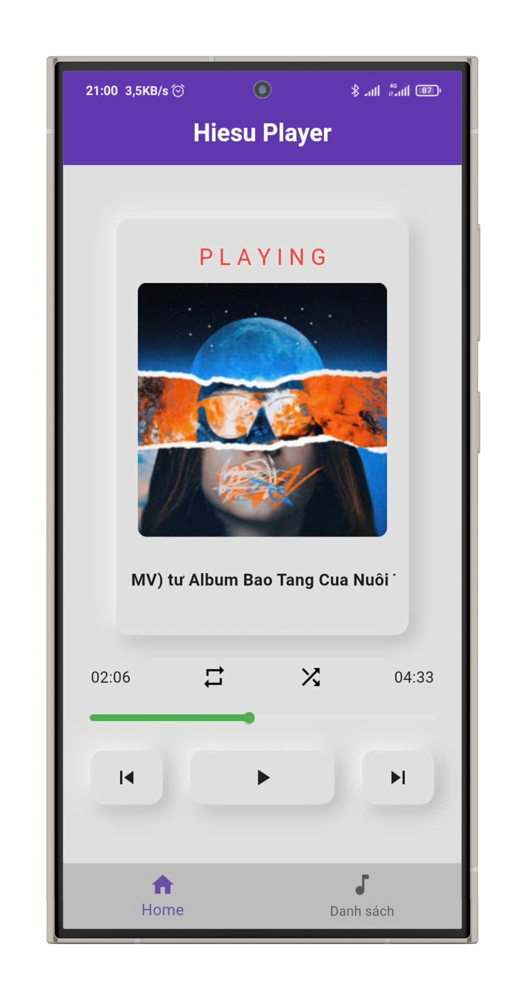

# Ứng dụng Phát nhạc Hiesu player đơn giản

Bài tập Project I kỳ 2024.1 Trường Công nghệ Thông tin và Truyền thông. Ứng dụng phát nhạc .mp3 đơn giản lấy trong bộ nhớ bằng Flutter.


## Installation

1. Clone the repo
   ```sh
   git clone https://github.com/Hiesu19/Music_app_Flutter.git
   ```
2. Install packages
   ```sh
   flutter pub get
   ```
3. Start your application Android
   ```
   flutter run
   ```
4. Build APK file
    ```
    flutter build apk
    ```
   
## Screenshots

<div>
  
  
  
   
   
</div>

## Download APK

[Download here](https://github.com/Hiesu19/Music_app_Flutter/releases/download/v1.1.1/Hiesu_player.v1.1.1.apk)


## Author

- Nguyễn Thái Hiếu: [@Hiesu19](https://github.com/Hiesu19)


